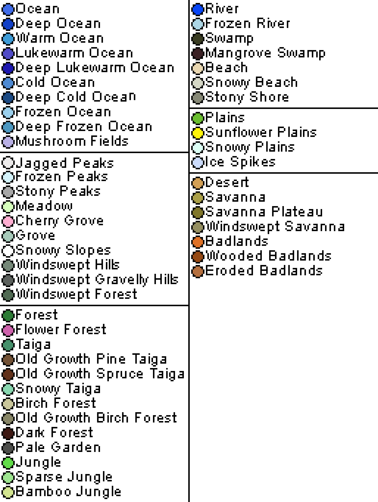

# How to Create a Dimension With Atlas
While the mod provides the functionality for generating worlds from height maps, 
you must still provide the data itself. Atlas does this through minecraft's existing  dimension data-pack configurations.

Fortunately, the template provided spares you the hassle of writing a data pack yourself, 
all you need to do is replace the `biomes.png` and `heightmap.png` files under the `data/minecraft/atlas/map` folder.
By default, the template will replace the overworld with your custom generated world.

## Using Atlas for Earth World Maps.
### Heightmap Source
Say you want to make a custom world from an existing area in the real world.
First, you need a heightmap source

A heightmap is a greyscale image that describes the elevation at each point in the world. Black (color #000000) is the lowest point,
and white (color #FFFFFF), is the highest point. Each pixel in the heightmap will correspond to a block in the world, with (x=0, z=0) being the pixel closest to the exact center of the heightmap image.
Additionally, the template assumes the highest block below sea is grey 62 (color #3E3E3E).

A good source for height maps is [GEBCO Gridded Bathymetry Data.](https://download.gebco.net/)
For our purposes, you'll want download with the GeoTiff Grid format. Be aware that these images are huge, as the scale is approximately 1:463 meters.
Prepare yourself for a long download time if your selected area is large.

### Heightmap processing
You'll likely have to process the heightmap first.
This is because the data is not corrected for your region of choice, so the lowest point may not be #000000, and your highest point may not be #FFFFFF.
Additionally, you'll want to convert the .tiff files into .pngs

You can use whatever image editing software that has a color adjustment curve, can downscale images, and can save to .pngs.
* First, resize your image to whatever size you wish, though it may give better results if you scale by a factor of the source image's size.
* Next, find the darkest and lightest greys in your image. How you do this may depend on the software you use.
* Adjust the color curve, with the darkest grey adjusted to grey 0, the lightest grey adjusted to grey 255, and grey 127 to grey 62, as that is used as the highest submerged block. 
* Resave the image as a png with the name `heightmap.png` into the `data/minecraft/atlas/map/` folder.

### Biome Map
The biome map is an image that specifies the biome at each block. The color of each pixel is mapped to a biome when world generation occurs. 
Unfortunately, there is no readily available source for a minecraft biome map of the world, so you'll have to paint the map yourself.
Despite this, there are some resources to make this process easier.

[The Olson & Dinerstein Biome Map](https://commons.wikimedia.org/wiki/File:Biomes_of_the_world.svg#/media/File:Biomes_of_the_world.svg) is used by the WWF for categorizing the earth's biomes. Most of these have minecraft equivalents.

Alternatively, the [Köppen climate classification map](https://commons.wikimedia.org/wiki/File:Koppen-Geiger_Map_v2_World_1991%E2%80%932020.svg#/media/File:Koppen-Geiger_Map_v2_World_1991%E2%80%932020.svg)
    describes the climate of every region in the world. While this doesn't state any specific biomes, it may make more sense to use this as a guideline than any real life biome map.

Again, you'll need some imagine editing software to paint the biome map, but here's some things to watch out for:
1. Make sure to disable anti-aliasing/use a pixel brush. The mod can only understand exact colors, the blurring caused by anti-aliasing can make the mod confused about what biomes are painted.
2. Use your heightmap to assist in painting. Depending on your software of choice, you may be able to select pixels at a certain brightnesses, which can make painting coasts or mountain boundaries easier.
    If your software doesn't have this feature, just make sure to paint land biomes at greys greater than, but not including grey 127.

The template data pack specifies the colors used for each biome. The hex codes are found in `data/minecraft/dimension/overworld.json`,
but the image below also visually shows them


## Customizing the dimension data further.
**You likely don't need to touch the dimension file in `data/minecraft/dimension/overworld.json`**, but if you want further customization, the follow describes every field.

*Note: This is verbatim from the original README*

## dimension type

the `type` field defines certain parameters about your world unrelated to atlas. it's a vanilla feature. when in doubt,
just set it to `minecraft:overworld`. if you want to go deeper, research `dimension types`-- again, this is a vanilla
feature. we're much more interested in the `generator` field.

## generator

to tell the game that you want this to be an atlas dimension, we set the `type` field *inside the `generator` field* to `atlas:atlas`.

### map info

`map_info` is a field that contains information about the terrain generation settings the mod should use. you can define
it inline, but it's much easier to define it in its own seperate file, since you'll need to use it more than once per
dimension. if you choose to go this route, a `map_info` should be stored at `/data/<namespace>/worldgen/atlas_map_info/path`.
so in this example, the `map_info` `avila:avila` is stored [here](./avila/data/avila/worldgen/atlas_map_info/avila.json).
see the "map info explained" section for how to configure this.

### settings

this field controls more nitty-gritty aspects of your world. default block, default fluid, et cetera. to make this process
easier, you can just use one of the three provided presets: `atlas:default`, `atlas:no_entrances`, and `atlas:no_noise_caves`.
they're pretty self-explanatory-- `default` is a normal world; `no_entrances` will remove the noise cave entrances from
your world, giving you a cleaner surface, a nd `no_noise_caves` disables all noise-based cave, except the pre-1.18 caves
that cut through the world regardless. if you want absolutely no caves, you'll need to remove the carvers from each
biome you use. this isn't too hard; it's just a ton of copy-pasting json files. see the "manually modifying `settings`"
section for some notes on how to modify this section more.

### biome source

the `biome_source` field controls how the biomes spawn in the world. the `type` should be `atlas:atlas`. the `map_info`
field should be the same as the previous one.

the `default` field is the name of the default biome the game should fall back on when no other biome fits. usually,
`minecraft:the_void` is sufficient for this.

`biome_map` is the path to your biome map PNG file. it can be anywhere in the datapack.

`biomes` is a list of biomes that you want to have in your map. each biome entry has a `color` field and a `biome` field;
these correspond to the color on the biome map that you want your biome to spawn at, and the name of the biome you want
to spawn there.

#### optional biome source fields:
`cave_biomes` is a set of biomes that will populate the underground. these biomes are generated using the default world
generator, and as such should be listed in vanilla's biome format. in theory, these biomes could be anything you want,
but most people will want to simply copy and paste this field from the [example](./avila/data/avila/dimension/avila.json).
the configuration in the default file will generate cave biomes as they are in the vanilla game. if you don't include this
field, you won't get cave biomes.

`below_depth` is the depth at which the cave biomes start spawning. for example, a `below_depth` of 10 means that cave
biomes can generate a minimum of ten blocks below the surface. in practice, this is uncommon-- it's best (and most accurate
to vanilla) to keep this value as close to zero as possible (setting it negative could cause cave biomes to spawn above the
surface, especially on the ocean floor!).

### map info explained

the `map_info` json file looks like this:

`/data/avila/worldgen/atlas_map_info/avila.json`
```json5
{
  "height_map": "avila:atlas/map/heightmap",
  "starting_y": 6,
  "horizontal_scale": 1,
  "vertical_scale": 1
}
```
this object tells the game important information about the map:

the `height_map` parameter tells the game where to find the heightmap file of the world in your datapack. it can be
anywhere in the datapack.

the `starting_y` parameter tells the game how high the lowest block in the heightmap should be-- i.e., `starting_y` is
the elevation that a black pixel on the heightmap represents in-game.

the `horizontal_` and `vertical_scale` parameters how to scale the image in-game. for example, a world with a both
parameters set to 1 will mean that the world is as many blocks across as there are pixels, and that the lowest point on
the surface will be 255 blocks below the highest point. a world with `horizontal_scale` set to 2 and `vertical_scale`
set to 3 will mean that the world will be twice as many blocks across as there are pixels in the image, and the lowest
point will be 768 blocks below the highest point. **these features are experimental! it's much preferred to do this
scaling in your image file beforehand.**

note: the `map_info` field _must_ be located in the folder `/data/<namespace>/worldgen/atlas_map_info/<path>.json`.

### other optional fields

#### aquifers

`aquifer` is an optional parameter for the `generator` object that allows you to specify the sea level at each point on
the map. it works the exact same as a heightmap, but corresponds to sea level instead of terrain elevation.

aquifers let you define the sea level at any point in the world. they work exactly the same as heightmaps. the sea level
at any given coordinate is calculated as the minimum of `sea_level` and the aquifer value at that point. if you want to
use an aquifer, add an `aquifer` field to your chunk generator and specify a path to the aquifer image, like so:
```json5
{
  "generator": {
    "type": "atlas:atlas",
    "aquifer": "my_datapack:path/to/PNGfile"
  }
}
```
if you don't include this field, the generator will default to using the sea level everywhere.

#### conditional biomes

in some cases, you may be working an environment where some biomes may not be loaded-- for example, if you want to use a
biome from another datapack, without including a hard dependency on that datapack. in that case, you can replace a biome
entry with a priority list, like so:
```json5
[ // list of biomes
  ...
  {
    // previous biome entry
  },
  {
    "priority": [
      "first_datapack:super_plains",
      "second_datapack:better_plains",
      "third_datapack:plains_two",
      "minecraft:plains"
    ],
    "color": 5081666
  },
  {
    // next biome entry
  },
  ...
]
```
atlas will check if `first_datapack:super_plains` is loaded. if so, it will use that biome for that color. if not, it
will check if `second_datapack:better_plains` is loaded, et cetera. **it is important to always end this list with a
vanilla biome, so that the world generator always has something to fall back on.**

#### manually modifying `settings`

modifying the `settings` field allows you to have more control over how the world generates. here you can change things
like default sea level, as well as manually modify cave generation. from a technical level, the world generates identically
to a vanilla noise-based chunk generator below `below_depth` blocks beneath the surface, with a few key differences:
- in order to have surface rules apply properly, you need to use `atlas:above_preliminary_surface` instead of
  `minecraft:above_preliminary_surface` in your surface rule.
- the `initial_density_without_jaggedness` function is what gets added to the surface generation to create cave entrances;
  setting this to 1 will remove them entirely, and setting it to 0 will remove all surface terrain.
